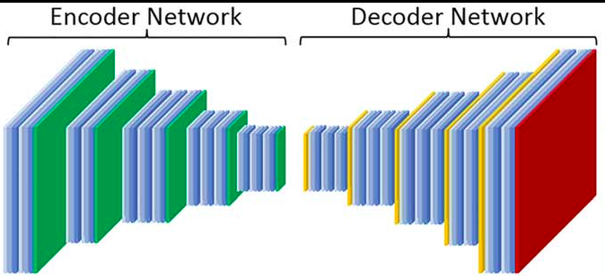

# Data Compression Techniques for Surface Pressure of Wind Turbines

This project is intended to compress the pressure sensors data of a wind Turbine at the edge near the sensors. It is a Multivariate Time Series data with 36 channels input. Deploying CNNs with residual blocks are used in this part of the project to obtain a reconstructed signal which can be used to detect anomalies over the blade.  




## Installation

The python environment that we used to developed all the codes and test the model is listed in the following file. It is highly recommended to install all the requirements before starting the project. 
You can install all the requirements by running the following command in terminal. 
```bash
python -m venv venv
. venv/bin/activate
python -m pip install -r requirements.txt
```

## Developement

There are the following folders that have the same structure. These folders contain different experiments that were conducted.

```bash
├── ablation_study
├── sets_of_sensors
└── simple_model_exploration
```

The folowing structre is present for the different experiments. Usually ```models.csv``` is a list with all trained models and its parametes. In the folder ```models``` are the corresponding models in a pickeld format. The folders ```results``` and ```plots``` contain the outputs of the respective scripts in ```src```. This folder is the only folder conatining code. Usually having the listed scripts below. To note is that its advised to not plot the results of the test script. Instead pickle the results of the ```test.py``` as a dict into the results folder. And then use the ```plot.py``` to visualize the results. This has the advantage that if we want later to visualize results in a different way, we can do so without rerunning the experiments, which are potentially very time consuming. 

```bash
├── models
├── models.csv
├── results
├── plots
└── src
    ├── models.py
    ├── plot.py
    ├── test.py
    └── train.py
```

Notice a 16 digit random number is assigned to each trained model where the hyper-parameters of the model are stored in the ```model.csv``` file. This unique number is used everywhere to identify the models.

## Contact 

To access data, please contact me via [Mail](amirhossein.moallem2@unibo.it)


## Project
```bash
├── LICENSE
├── plots
├── README.md
├── src
│   ├── ae_model.py
│   ├── ae_model_test.py
│   ├── data_save.py
│   ├── dataset_ae.py
│   ├── input_shape_trial.py
│   ├── main_test.py
│   ├── main_train.py
│   └── pytorch_to_onnx.py
└── trained_models
```
